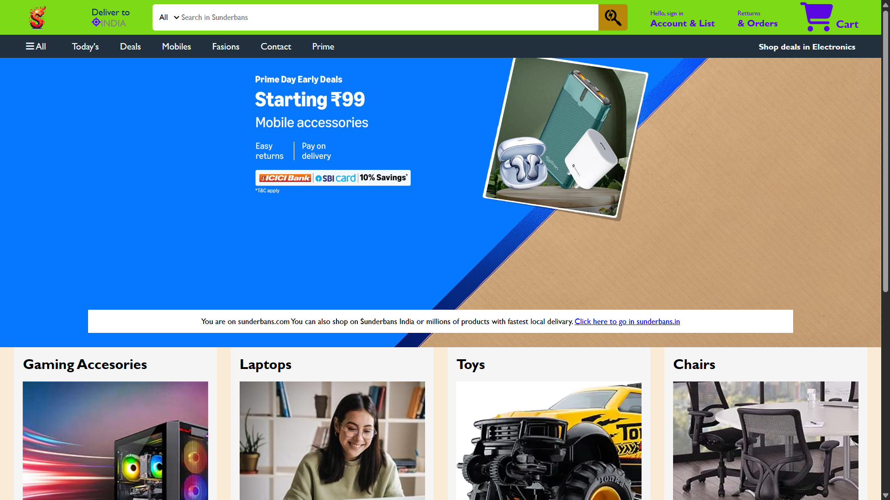

# Sundarbans 🛒 — Amazon Homepage Clone (Frontend Project)

Sundarbans is a frontend-only e-commerce website project inspired by the design and layout of Amazon's homepage. This project focuses on recreating the user interface, including the navigation bar, search section, product categories, promotional banners, and product display sections using modern frontend technologies.

The goal of this project is to practice and improve frontend development skills such as responsive design, UI structuring, component organization, and styling techniques. No backend functionality, authentication, or real shopping features are implemented — this project is purely a visual and interactive frontend clone.

# Tech Stack:

HTML5
CSS3

# Features:

✅ Amazon-inspired homepage layout
✅ Responsive design
✅ Navigation and search UI
✅ Product cards and category sections
✅ Clean and organized frontend structure

**Note: This project is created for educational purposes and is not affiliated with Amazon.
